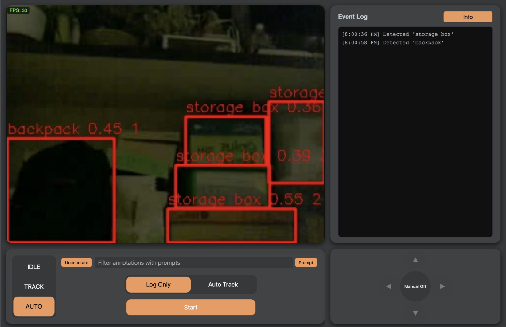

# PiSentinel

**Real-time object tracking turret controlled via a web dashboard**

## Overview

This project is a **Raspberry Pi 5-powered camera turret** capable of tracking objects using computer vision and ROS2. It features a **real-time dashboard** for manual control, **autonomous scanning and tracking modes**, and interactive prompts, with support for annotations and multi-object tracking.

## Key Features

- Real-time object detection and tracking with **YOLOE** and **MOT/SOT** pipelines  
- Multiple operational modes, including **autonomous** modes: Auto-Tracking, Scanning, and Prompt-based tracking, as well as Manual mode
- Live **annotated camera feed** streamed to a React dashboard at ~**30 FPS**
- Toggleable **annotation and prompt filters**  
- Event logging and turret state management via ROS2 nodes  
- Fully deployed on **Raspberry Pi 5**, integrating hardware control and software pipeline  

## Tech Stack

- **Frontend:** React
- **Backend / Robot:** ROS2 (Humble), Python nodes, Linux
- **Computer Vision:** Ultralytics YOLOE, OpenCV, MOT/SOT pipelines  
- **Hardware:** Raspberry Pi 5, Pi Camera Module 2, SG90 servos, ESP32
- **Deployment:** Fully containerized and run on Raspberry Pi OS  

## Node Architecture

| Node                  | Inputs                                                                 | Outputs                                                                  | Purpose                                                          |
|-----------------------|------------------------------------------------------------------------|--------------------------------------------------------------------------|------------------------------------------------------------------|
| stream_to_image_node  | HTTP MJPEG stream                                                      | /camera/image_raw /camera/info                                         | Converts MJPEG stream to numpy array                              |
| prompt_cv_node        | /camera/image_raw /turret/state                                     | /detection/raw /turret/event                                          | Takes in prompt, runs YOLOE pose model                            |
| mot_node              | /detection/raw /turret/state /camera/info                        | /detection/mot or /detection/overlay /turret/event                   | Tracks all objects with IDs                                        |
| sot_node              | /detection/mot /turret/state /camera/image_raw                   | /detection/overlay /turret/event                                      | Runs SOT on a single object                                        |
| tracking_node         | /detection/overlay /turret/state                                    | /motor/cmd                                                               | Sends delta angles for tracking                                    |
| scanning_node         | /detection/overlay /turret/state /turret/position                | /motor/cmd                                                               | Sends delta angles for scanning                                    |
| manual_node           | /motor/manual                                                          | /motor/cmd                                                               | Manual control from frontend                                       |
| motor_node            | /motor/cmd                                                             | /turret/position                                                         | Sends absolute angles to motors                                     |
| annotated_publisher   | /detection/overlay /camera/image_raw /annotated /viewer/heartbeat | /camera/annotated/compressed                                             | Publishes annotated frames for live view                            |
| logging_node          | /turret/state /turret/event                                         | /turret/log                                                               | Logs turret events and state                                        |
| state_manager         | /input                                                                 | /turret/state                                                             | Maintains turret state                                              |
| local script          |                                                                        |                                                                          | Forwards local rosbridge to remote server                           |
| backend               |                                                                        |                                                                          | Acts as a tunnel between script and frontends                       |
| frontend              | /camera/annotated/compressed /turret/log                            | /input /viewer/heartbeat /annotated                                | Connects to backend and renders dashboard                           |

## Screenshots

